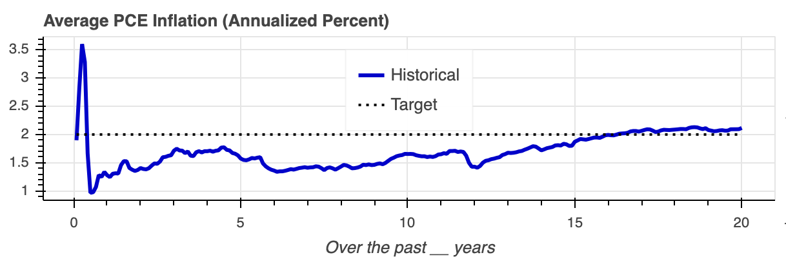
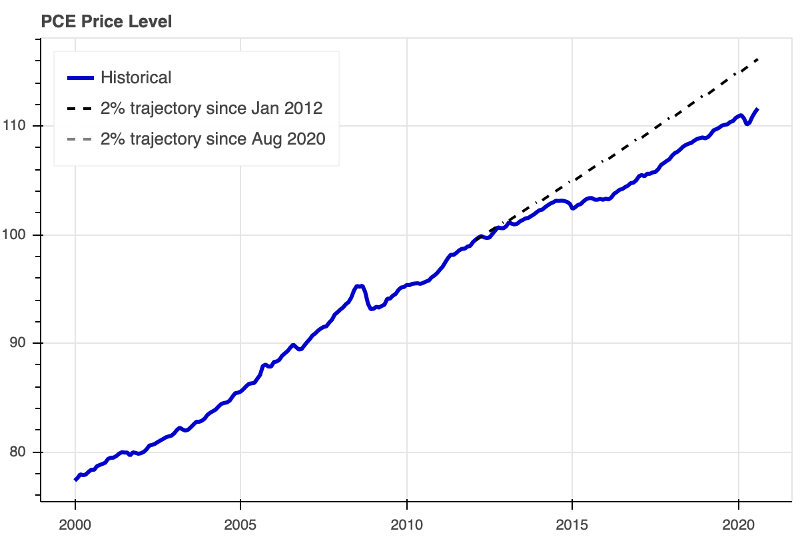

Today, I launched the [Inflation Targeting Dashboard](christopher-russo.github.io/dashboard/inflation-targeting). Its purpose is to illustrate the actual growth of dollar prices against the goal of the Federal Open Market Committee (FOMC), the body which sets monetary policy for the United States. The dashboard is free to access, with the intention of better informing the public. In this post, I provide additional guidance on understanding these data and the Fed's inflation target.

Under the Federal Reserve Act (as ammended by the Federal Reserve Reform Act of 1977), the Federal Reserve is mandated by Congress to "promote effectively the goals of maximum employment, stable prices and moderate long-term interest rates." The Inflation Targeting Dashboard focuses on the second mandate: price stability.

There are many different measures of the price level. For example, the U.S. Bureau of Economic Analysis produces the Personal Consumption Expenditures (PCE) price index. This index measures the prices of goods and services purchased by consumers in the United States. Another measure is the Consumer Price Index (CPI) produced by the U.S. Bureau of Labor Statistics. Divergences between these popular meausures are generally due to differences in their underlying data and calculation methodologies. Still, they tend to measure similar changes in the prices faced by U.S. consumers.

For both indices, there are so-called "core" measures which omit food and energy prices. While food and energy are important expenses faced by consumers, their prices are especially volatile. Policymakers often look at core (or similar lower-volatility) measures to better understand longer-term inflation trends.

The PCE price index is the FOMC's preferred price measure. Under their interpretation of the price stability mandate, the FOMC targets a 2 percent annual increase in PCE prices, *including* food and energy.

> The inflation rate over the longer run is primarily determined by monetary policy, and hence the Committee has the ability to specify a longer-run goal for inflation. The Committee reaffirms its judgment that inflation at the rate of 2 percent, as measured by the annual change in the price index for personal consumption expenditures, is most consistent over the longer run with the Federal Reserve's statutory mandate.[[1]](#note1)

As of writing, PCE inflation has generally run below 2 percent since the adoption of this target in 2012. Still, policymakers have regularly emphasized that 2 percent is intended as a target and not a cap. While consumers and lenders tend to benefit from unexpectedly low inflation, standard macroeconomic models suggest that persistent inflation shortfalls can limit a central bank's ability to combat recessions.

In response to falling short of their inflation target, the FOMC recently adopted a policy of flexible, average-inflation targeting. Under this policy, policymakers will now attempt for inflation to first overshoot before returning to 2 percent.

> The Committee seeks to achieve inflation that averages 2 percent over time, and therefore judges that, following periods where inflation has been running persistently below 2 percent, appropriate monetary policy will likely aim to achieve inflation moderately above 2 percent for some time.[[2]](#note2)

So far, policymakers have been intentionally ambiguous about how high they intend to let inflation run, as well as for how long. As recently explanined by FOMC Chairman Powell,

> In seeking to achieve inflation that averages 2 percent over time, we are not tying ourselves to a particular mathematical formula that defines the average... Our decisions about appropriate monetary policy will continue to reflect a broad array of considerations and will not be dictated by any formula.[[3]](#note3)

The figures on the left-hand side of the dashboard show average inflation over horizons between 0 and 20 years. Averages within one year may be especially volatile due to only including the most recent observations. Averages over longer horizons illustrate how well the FOMC has achieved their average inflation target. If successful, longer-horizon averages will tend to be close to the 2-percent target.

As of October 2020, for horizons greater than 1 year and less than 16 years, average PCE inflation has significantly undershot the FOMC's 2-percent target. Core PCE, CPI, and core CPI have similarly undershot. In other words, average inflation only reaches 2 percent with a horizon beginning before 2005, well before the FOMC adopted inflation targeting.

Figures on the right-hand side of the dashboard show the actual price level relative to "idealized" price-level trajectories. The first trajectory shows prices increasing exactly 2 percent per year since January 2012, the month in which the Fed adopted inflation targeting. As of October 2020, we can see the consequences of undershoting the inflation target for so long: actual prices lag well below the idealized trajectory. The second trajectory has just been launched using August 2020 as its starting point, the month in which the Fed adopted average-inflation targeting. The trajectory will populate as new inflation data are released.

As we receive new inflation data over time, we can use the dashboard to monitor the success or failure of average-inflation targeting. If successful, we will see near-term average inflation above 2 percent and longer-term inflation (say, 3-10 years) move up towards 2 percent. At the same time, we would see the price level running above the trajectory launched in August 2020, partially closing the gap with the trajectory launched in January 2012.

**Acknowledgements:** I created the [Inflation Targeting Dashboard](https://christopher-russo.github.io/dashboard/inflation-targeting/) using the Bokeh (pronounced “bouquet”) visualization library for Python. My sincere thanks to the Bokeh and Python teams, contributors, and sponsors. For more information, please see [https://bokeh.org](https://bokeh.org) and [https://www.python.org](https://www.python.org).

___

 [[1]](#back1) Federal Open Market Committee, “Statement on Longer-Run Goals and Monetary Policy Strategy”, as amended effective August 27, 2020. Retrieved from <https://www.federalreserve.gov/monetarypolicy/files/FOMC_LongerRunGoals.pdf>, September 15, 2020.

 [[2]](#back2) *ibid.*

 [[3]](#back3) Jerome Powell (Board of Governors), “New Economic Challenges and the Fed’s Monetary Policy Review”, published August 27, 2020. Retrieved from <https://www.federalreserve.gov/newsevents/speech/powell20200827a.htm>, September 15, 2020.

___

&copy; 2020 Christopher Russo. All rights reserved.