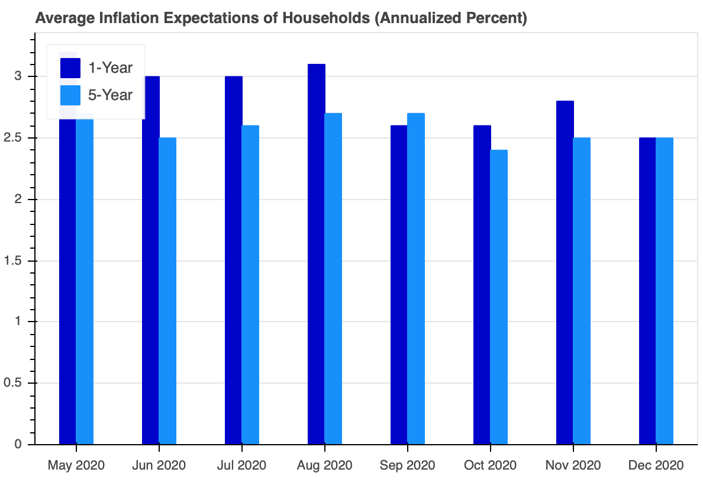
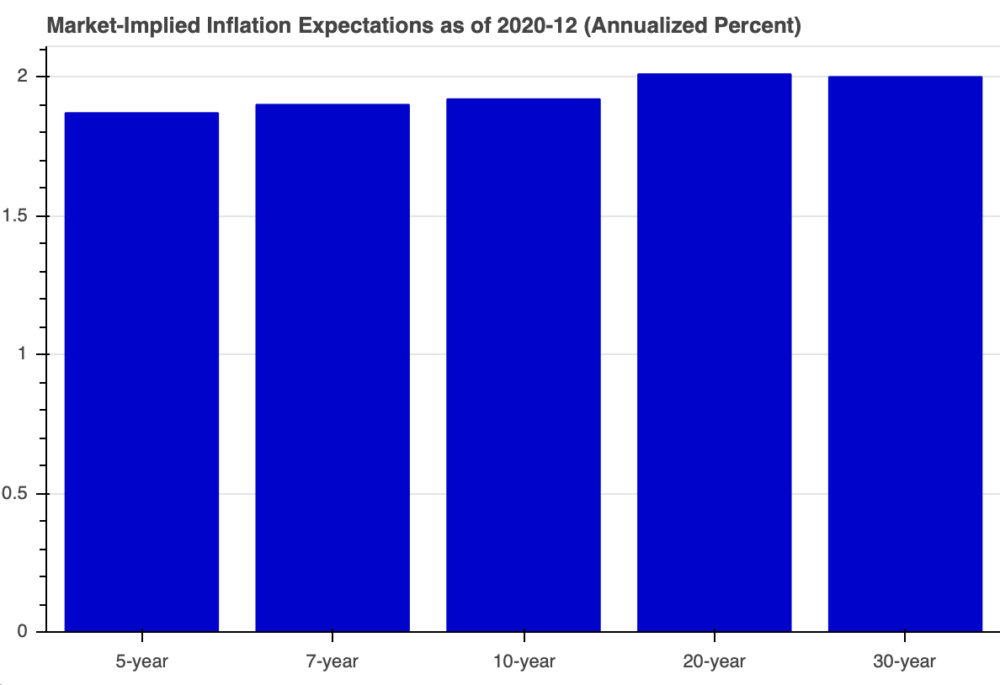
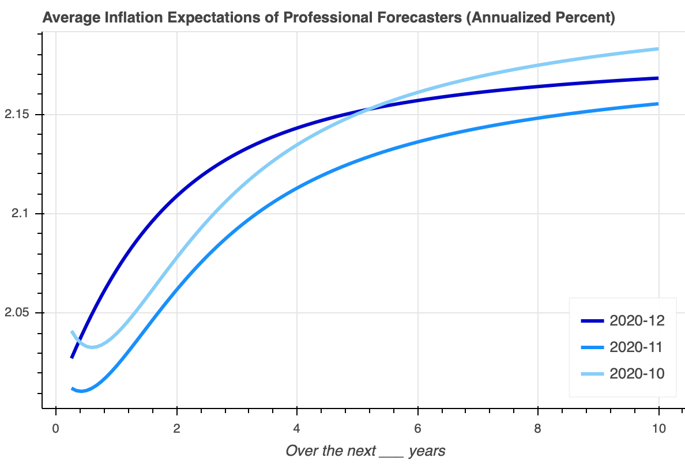

Today, I launched the [CPI Inflation Expectations Dashboard](https://christopher-russo.github.io/dashboard/cpi-inflation-expectations/). Its purpose is to visualize the expected growth of consumer prices in the United States. The dashboard is free to access with the intention of better informing the public. In this post, I provide additional guidance on understanding these data.

**Consumer Price Index (CPI):** The CPI is produced by the U.S. Bureau of Labor Statistics (BLS) and is widely cited in the United States. Foremost, the CPI informs the general public about changes in the prices of consumer goods and services; helps businesses negotiate long-term contracts; and adjusts certain government payments for inflation, like Social Security benefits. Because CPI statistics are used for these many different purposes, the BLS produces several different flavors of the CPI. Each flavor has a modified calculation method reflecting its purpose. Here, I discuss two of the most common measures: headline CPI and core CPI. 

When people refer to "the CPI," they generally mean headline CPI. Headline CPI tracks prices for a broad basket of goods and services purchased by urban consumers in the United States. The items of the basket are sourced from a regular, detailed survey of consumer spending choices. For example, contrary to some misconceptions, headline CPI includes food, energy, and housing costs. It also includes out-of-pocket medical costs; education costs like tuition; and taxes on spending like sales and excise taxes.

Core CPI is a commonly cited, alternate flavor of the CPI. Unlike headline CPI, core CPI excludes food and energy from its calculations. While food and energy are essential items for consumers, their prices are highly volatile. This month-to-month volatility can obscure longer-term inflation trends. Policymakers sometimes use core CPI to better understand those trends. Nonetheless, the government's inflation-adjusted payments (like Social Security benefits and certain types of Treasury debt) use a CPI including food and energy prices. 

In all flavors, the CPI is not a cost-of-living index. For example, it:

- does not account for the burden of taxes unrelated to consumer prices, such as income and payroll taxes;
- does not account for the amount and quality of governent services, or lack thereof; 
- does attempt to offset price increases for perceived quality increases; and 
- does attempt to track the cost of consumer purchases that people actually make, not the cost of a minimum basket required for families to thrive. 

Ultimately, given the purpose of the CPI, these calculation methodologies reflect the professional judgment of economists and statisticans at the BLS. For more information about the CPI and its calculation, see [Consumer Price Index Frequently Asked Questions](https://www.bls.gov/cpi/questions-and-answers.htm). With these caveats in mind, let's turn to the dashboard.

**Recent Inflation:** The first figure (top left) shows realized CPI inflation over the past 24 months. While inflation is difficult to forecast based on historical data alone, it can be a useful input into forming expectations. We can see inflation dropped sharply in the first half of 2020. At the same time, U.S. economic output sharply contracted (not shown) due to state and local governments banning many forms of economic activity. Output and inflation have recovered as these bans were lifted and lessened, but inflation is still depressed relative to its recent level. Even with these large changes in economic conditions, we see that core CPI inflation varies less than headline CPI inflation. 

**Expectations of Households:** The second figure (top right) shows the average CPI inflation expectations of U.S. households. These expectations are sourced from the University of Michigan's monthly *Survey of Consumers*. Historically, these survey expectations overshoot actual inflation and professional forecasts. One-year inflation expectations have dropped down to about 2.5 percent over the last several months. Five-year inflation expectations have held steady at around 2.5 percent.

**Expectations of Market Participants:** The third figure (bottom left) shows the CPI inflation expectations of financial market participants, calculated as the spread between yields on nominal and inflation-indexed government debt. By this measure, market participants expect annual inflation to run below 2 percent over the next 10 years, with average annual inflation rising to about 2 percent over the next 20 and 30 years. Still, we should interpret these figures with caution. Inflation-indexed debt typically trades at a price discount (i.e. higher yield) due to to its relative illiquidity. Correspondingly, these market measure of inflation expectations can tend to understate true inflation expectations. [[1]](#note1)

**Expectations of Professional Forecasters:** The fourth figure (bottom right) shows the average CPI inflation expectations of professional forecasters. Published by the Federal Reserve Bank of Philadelphia, these curves show a blend between two sources of professional forecasts: the Blue Chip Economic Indicators and the Survey of Professional Forecasters. On average, these forecasters expect annual inflation to modestly rise over the next 10 years, but remain anchored around 2 percent. These expectations sit above the expectations of market participants, but below the expectations of households.

All of these sources of inflation expectations--household surveys, market prices, and professional forecasts--suggest that CPI inflation will remain low and stable around 2 percent per year. Still, be watchful for large increases or decreases in these measures. Large swings in inflation expectations can signal economic trouble on the horizon. With the dashboard, we can easily monitor these expectations.

**Acknowledgements:** I created the [CPI Inflation Expectations Dashboard](https://christopher-russo.github.io/dashboard/cpi-inflation-expectations/) using the Bokeh (pronounced “bouquet”) visualization library for Python. My sincere thanks to the Bokeh and Python teams, contributors, and sponsors. For more information, please see [https://bokeh.org](https://bokeh.org) and [https://www.python.org](https://www.python.org).

___

 [[1]](#back1) Kim, Don, Cait Walsh, and Min Wei (2019). "Tips from TIPS: Update and Discussions," FEDS Notes. Washington: Board of Governors of the Federal Reserve System, May 21, 2019, <https://doi.org/10.17016/2380-7172.2355>. Retrieved from <https://www.federalreserve.gov/econres/notes/feds-notes/tips-from-tips-update-and-discussions-20190521.htm>, January 6, 2021.

___

&copy; 2021 Christopher Russo. All rights reserved.